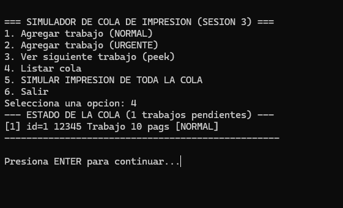
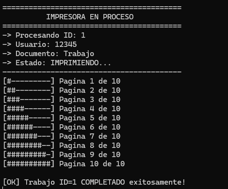
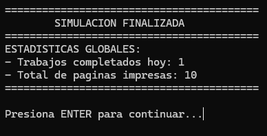

# Práctica 1: Elementos básicos de los lenguajes de programación

**Nombre:** JARETH IZHAR APARICIO LOPEZ

**Matrícula:**  376619

**Materia:** PARADIGMAS DE LA PROGRAMACION

---

## 1. Introducción

El presente proyecto consiste en el desarrollo de un simulador de cola de impresión, un problema clásico que ilustra la gestión de recursos compartidos en los sistemas informáticos. En un entorno real, múltiples usuarios envían documentos simultáneamente a una única impresora. Para evitar la pérdida de datos y garantizar un orden justo de atención, es indispensable implementar una estructura de control temporal.

Para resolver este problema, se eligió utilizar una estructura de datos tipo **Cola (Queue)**, ya que modela de forma natural la política **FIFO (First-In, First-Out / Primero en entrar, primero en salir)**. A través de tres iteraciones, este simulador evoluciona desde un modelo rígido de memoria estática (arreglos fijos) hacia una arquitectura robusta y escalable utilizando memoria dinámica (listas enlazadas), culminando en una simulación visual que soporta prioridades y estadísticas.

---

## 2. Diseño de la Solución

### Definición de Estructuras (Tipos de Datos)
Para modelar los trabajos de impresión, se diseñó la estructura `PrintJob_t`, la cual encapsula toda la información necesaria:
* **Identificadores y Metadatos:** `id` (autoincremental), `usuario` y `documento`.
* **Control de Simulación:** `paginas_total` y `paginas_restantes` (vital para la barra de progreso iterativa), además de `ms_por_pagina` para el delay temporal.
* **Estados y Prioridad (Enums):** `estado` (EN_COLA, IMPRIMIENDO, COMPLETADO) permite rastrear el ciclo de vida del trabajo, mientras que `prioridad` (NORMAL, URGENTE) permite gestionar interrupciones en el flujo estándar.

### Diagramas de Arquitectura (Estática vs Dinámica)

**A Cola Estática (Sesión 1)**
Basada en un arreglo fijo y un contador `size`. El frente siempre es el índice 0, lo que obliga a desplazar los elementos al extraer uno.

```text
[Frente] -> data[0] | data[1] | data[2] | ... | data[9] <- [Límite MAX_JOBS]
              Job A |   Job B |   Job C | ... |  Vacío 
```
**B Cola Dinámica (Sesión 2 y 3)**
Basada en Nodos (Node_t). Crece dinámicamente usando punteros head (frente) y tail (final).
```text
[head] ---> [ Node_t: Job A ] ---> [ Node_t: Job B ] ---> [ Node_t: Job C ] <--- [tail]
             *next ---------/       *next ---------/       *next: NULL
```
## 3. Implementacion
El sistema se dividió en funciones atómicas con responsabilidades únicas:
* **init:** Inicializa los valores de la estructura (contadores a 0, punteros a NULL).

* **enqueue / enqueue_priority:** Inserta elementos. En la versión final, valida si el trabajo es URGENTE para saltarse los trabajos NORMALES, respetando el orden entre urgentes.

* **dequeue:** Extrae el frente de la cola y avanza al siguiente.

* **peek:** Solo consulta el frente sin extraerlo.
* **destroy:** (Solo dinámica) Recorre la cola vaciándola para liberar la memoria pendiente.
  
**Decisión relevante:** Se implementó una función vaciar_buffer() que utiliza getchar() para limpiar la entrada estándar. Esto evita el conocido error de ciclos infinitos en C cuando un usuario introduce caracteres en lugar de números en un scanf.

## 4. Demostración de Conceptos ##
4.1. Alcance y Duración de Variables

El manejo adecuado del tiempo de vida de las variables es crítico:

```text
int main() {
    QueueDynamic_t cola;
    int contador_id = 1; // Alcance: Local a main. Duración: Toda la ejecución del programa.
    
    
    case 1: {
        PrintJob_t nuevo_trabajo; // Alcance: Local al bloque del case. Duración: Efímera (se destruye al romper el bloque).
        nuevo_trabajo.id = contador_id;
```
   Contador_id se declaró en main y no como variable global para mantener un código limpio y evitar efectos secundarios (side-effects) desde otras funciones.

## 4.2. Manejo de Memoria (Stack vs Heap) ##
La transición de la Sesión 1 a la 2 implicó mover los datos de la memoria automática (Stack) a la memoria dinámica (Heap):
```text
int qd_enqueue(QueueDynamic_t* q, PrintJob_t job) {
    // RESERVA EN HEAP: Malloc solicita memoria al SO.
    Node_t* new_node = (Node_t*)malloc(sizeof(Node_t)); 
    if (new_node == NULL) return 0; // Validación obligatoria
    // ...
}

int qd_dequeue(QueueDynamic_t* q, PrintJob_t* out) {
    Node_t* temp = q->head;
    *out = temp->job;
    q->head = q->head->next;
    // LIBERACIÓN DEL HEAP: Previene fugas de memoria (Memory Leaks).
    free(temp); 
}
```
## 4.3. Contratos de Funciones (Mutabilidad) ## 
```text
// CONTRATO MODIFICADOR: Recibe un puntero normal (*q) porque necesita alterar la estructura (size, tail, head).
int qd_enqueue(QueueDynamic_t* q, PrintJob_t job);

// CONTRATO DE SOLO LECTURA: Usa 'const'. Garantiza que 'peek' solo consulta y el compilador impedirá cualquier modificación accidental.
int qd_peek(const QueueDynamic_t* q, PrintJob_t* out);
```
## 5. Simulación de Impresión ##
La simulación (Sesión 3) integra los datos de la cola en un proceso interactivo. Utiliza un bucle while que evalúa paginas_restantes de cada PrintJob_t.

* **Progreso: Imprime visualmente el carácter # basado en el cálculo de páginas completadas.**

* **Delay: Se utilizó la macro multiplataforma SLEEP_MS (enlazada a usleep en Unix o Sleep en Windows) alimentada por el campo ms_por_pagina para emular el tiempo físico de la impresora.**

* **Transición de Estados: Cambia de EN_COLA a IMPRIMIENDO al extraer, y a COMPLETADO al terminar el ciclo de páginas.**
  
Evidencia de Ejecución:

.
.
.


## 6. Análisis Comparativo: Estática vs. Dinámica ##

Al evaluar ambas implementaciones, se destacan diferencias críticas en rendimiento y arquitectura:

1. Límites y Flexibilidad: 
    La cola estática está restringida a un límite rígido (MAX_JOBS = 10) definido en tiempo de compilación. Si la demanda crece, los trabajos se rechazan. La cola dinámica crece según la necesidad; su único límite es la memoria RAM disponible del sistema.

2. Complejidad Algorítmica (Tiempo):

    Estática: La inserción (Enqueue) es O(1), pero la extracción (Dequeue) es O(n) lineal. Al estar el frente anclado en data[0], cada extracción obliga a un bucle que desplaza (shift) todos los elementos restantes a la izquierda.

    Dinámica: Ambas operaciones (Enqueue normal y Dequeue) son O(1) constante. Solo se requiere reasignar punteros (head y tail), eliminando el cuello de botella del desplazamiento.

3. Complejidad Espacial (Memoria) y Riesgos:
   
    La versión estática reserva memoria fija O(1) desde el inicio, independientemente de si está vacía o llena (desperdicio seguro). La versión dinámica reserva O(n) variable (consumo exacto), pero introduce el riesgo crítico de fugas de memoria (Memory Leaks). Si olvidáramos invocar free() durante el dequeue o al invocar la función qd_destroy al salir, la memoria quedaría huérfana, mermando el rendimiento del SO.

## 7. Conclusiones

El desarrollo de esta práctica permitió contrastar de forma analítica los paradigmas de manejo de memoria en C. Se comprobó que la memoria estática ofrece una implementación inicial segura pero ineficiente algorítmicamente para el problema de impresión por sus costosos desplazamientos. La migración a memoria dinámica resolvió estas limitaciones y permitió implementar lógicas más complejas (como colas de prioridad), exigiendo a cambio una rigurosa responsabilidad en el control manual del ciclo de vida de los datos.

Oportunidades de Mejora:
Para futuras iteraciones, sería ideal implementar persistencia de datos (guardar la cola en un archivo .txt al cerrar) y multihilo (multithreading) para permitir que el usuario siga agregando trabajos mientras la simulación de impresión corre en segundo plano de manera asíncrona.

## Referencias
Kernighan, B. W., & Ritchie, D. M. (1988). The C Programming Language (2nd ed.). Prentice Hall.

Documento Otorgado por el profesor mediante Clasroom.